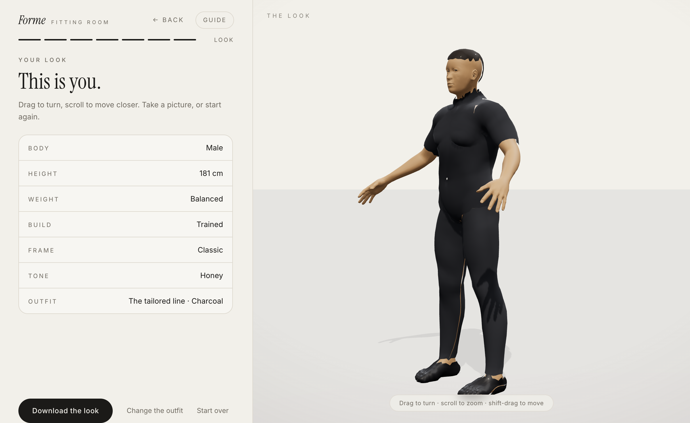

# FORME

Build the look, then the outfit.

A calm, minimal 3D fitting room in the browser: shape a real human body with a
guided set of questions, then dress it from a small, considered rail of looks.
Every garment is generated from the body itself, so anything fits anybody.



## What it does today

- **Seven quiet questions** in one flow: body, height, weight, build, frame,
  skin tone, then the wardrobe. Discrete picks advance on their own; every
  optional step has a default, so a visitor can simply press through.
- **A real human body.** The figure is the MakeHuman hm08 base mesh (CC0)
  carrying 26 curated morph targets (gender, weight, muscle, frame, height,
  bust, hips, jaw) that are damped smoothly as choices land. It breathes and
  sways gently, and the eyes follow the head morphs.
- **Garments that fit like fabric.** Each piece of clothing is a shell derived
  from the body mesh itself: region masks come from the underlying Mixamo
  skeleton, the shell is offset along surface normals, and the mask boundary
  is smoothed so hems and necklines read as cloth on skin. Tee, hoodie,
  tailored line, denim on denim, sundress and a skirt set today, plus a fitted
  hair cap grown from the scalp.
- **Free camera.** Drag to orbit, scroll or pinch to zoom, shift-drag or
  two-finger drag to move the model, double-click to bring it back. A reset
  pill appears when the view has been moved.
- **A tour on first visit** that walks through the room in eight stops, and a
  Guide button to reopen it at any time.
- **Take the look away**: the stage can be downloaded as a PNG from the result
  step.

## Getting started

```bash
npm install
npm run dev        # http://localhost:5173
npm run typecheck  # tsc --noEmit
npm run build      # typecheck + production bundle
npm run test:e2e   # Playwright, needs: npx playwright install chromium
```

## How the body and the clothes work

```
src/lib/human/rig.ts        the whole engine, one file
  prepareRig()              reads the GLB: base mesh, skin weights, the 26
                            morph targets, joint anchors, region masks
  shellFromDef()            builds a garment: region mask -> falloff -> normal
                            offset -> smoothed boundary -> skinned shell
  morphWeights()            sex/height/weight/build/frame -> morph weights
  setOutfitLayers()         visibility per outfit + collar/belt/skirt extras
  applyTone()               skin palette and fabric colorways
  applyIdle()               breathing, head sway, weight shift on the rig
```

Garments are `SkinnedMesh`es bound to the same skeleton and carrying the same
morph targets as the body, so they deform with every body change and idle
motion for free. Small disconnected surface patches (brow, lash and similar
helper shells baked into the base) are dropped by connected-component size so
they never pick up the wrong material.

## Assets and licensing

- `public/models/human-base.glb` - the MakeHuman hm08 base mesh with curated
  morph targets, baked from [nirholas/three.ws](https://github.com/nirholas/three.ws)
  `avatar-sources/anny`, which vendors the CC0 MakeHuman/MPFB2 data from
  [naver/anny](https://github.com/naver/anny). The mesh data is
  **CC0 1.0** (MakeHuman project, September 2020); credit to MakeHuman and
  Naver's anny as good citizenship.
- Everything in `src/` is MIT.

## Known edges

- Hands and feet are separate shells in the base mesh; they are kept whole.
- The hair cap is short by design. Longer styles want authored geometry.
- Morph targets beyond the 26 in use are stripped at load; the source asset
  carries 306.

## License

MIT for the code. The bundled avatar mesh is CC0 - see above.
